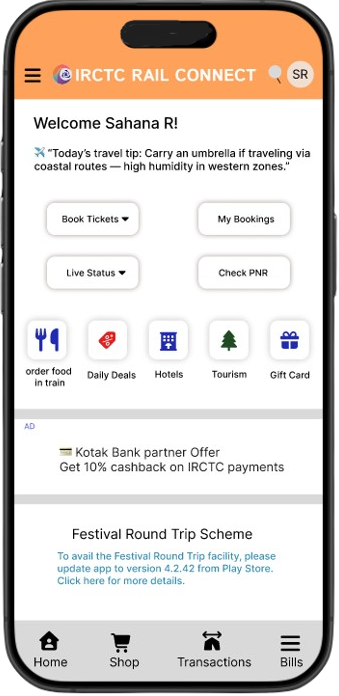

## 🔎 Note

This project was designed as part of my UX Design case study and serves as a creative exploration rather than a live application.
It showcases my skills in **UI/UX design, interaction design, and front-end presentation** using a playful and nostalgic concept.

# IRCTC Redesign

This is a self-initiated redesign of the IRCTC Rail Connect Android app.
The goal was to streamline the core booking journey, remove friction points, and improve clarity while preserving familiarity expected from an official government platform.

## 🚀 Tech Stack

* HTML
* CSS
* Figma (for UI Design)
  

## This project explores:

* Re-structuring navigation and hierarchy
* Designing cleaner search, listing, and payment flows
* Reducing overwhelm for first-time and low-tech users
* Creating a warmer, more approachable visual language
* Making key actions more discoverable without removing functionality

## 📂 Project Context

Created as a personal UX case study to rethink a complex government app and design a clearer, more intuitive train-booking experience.

## 📸 Screenshots

